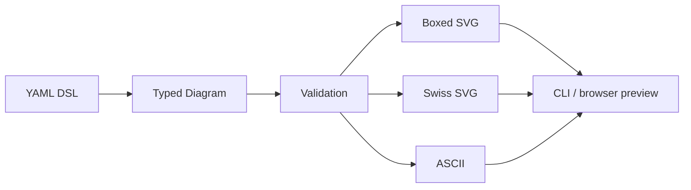

# Context Window Render

Context Window Render (`cwr`) is a small Go tool for describing LLM context-window budgets in YAML and rendering them as diagrams. It is meant for design docs, prompt architecture reviews, RAG pipeline planning, and agent trace explanations where a single number such as `128k` is not enough to understand how the window is being used.

The project has three complementary output styles:

- **Boxed SVG** — a proportional Macintosh-inspired block diagram with regions, subregions, labels, warnings, and overflow markers.
- **Swiss SVG** — an aligned text-table diagram with semantic color, indentation, exact token counts, percentages, and a compact allocation line.
- **ASCII** — a terminal-friendly audit view with box drawing, fill lines, and explicit hierarchy.


## Why this exists

Context windows are structured budgets. A prompt may contain system instructions, tool definitions, retrieved documents, conversation history, user input, scratch work, and generation budget. These components do not have the same role, and their relative sizes matter.

`cwr` makes that structure explicit. The YAML file is the source of truth; renderers are views over the same typed model.



## Installation / build

This repository is currently intended to be built from source.

```bash
git clone git@github.com:wesen/2026-06-04--context-window-render.git
cd 2026-06-04--context-window-render
go build -o cwr ./cmd/cwr
```

Run the CLI help:

```bash
./cwr --help
./cwr render --help
./cwr serve --help
```

## Quick start

Render the RAG example as boxed SVG:

```bash
./cwr render \
  --file examples/03-rag-pipeline.yaml \
  --format svg \
  --style boxed \
  --out output/rag-boxed.svg
```

Render the same diagram as Swiss typography SVG:

```bash
./cwr render \
  --file examples/03-rag-pipeline.yaml \
  --format svg \
  --style swiss \
  --out output/rag-swiss.svg
```

Render ASCII to stdout:

```bash
./cwr render \
  --file examples/03-rag-pipeline.yaml \
  --format ascii
```

Serve all examples in a local browser preview:

```bash
./cwr serve --dir examples --port 8080
```

Then open:

```text
http://localhost:8080/
http://localhost:8080/d/03-rag-pipeline
```

Each per-diagram page shows:

- boxed SVG
- Swiss classic SVG
- Swiss cool SVG
- Swiss warm SVG
- ASCII
- YAML DSL source

The server watches YAML modification times and re-renders in memory when files change. Refresh the browser to see updates.

## YAML DSL

A diagram can contain either one `window` or multiple `windows`. A window declares total token capacity and an ordered list of regions. Regions may contain subregions.

```yaml
window:
  size: 128k
  title: "RAG Pipeline"
  regions:
    - name: System Prompt
      size: 2k
      color: accent
    - name: Tool Definitions
      size: 6k
      color: tool
    - name: Retrieved Documents
      size: 40k
      color: knowledge
      subregions:
        - name: "Doc 1: API Reference"
          size: 15k
          color: knowledge-light
        - name: "Doc 2: User Guide"
          size: 12k
          color: knowledge-light
        - name: "Doc 3: Changelog"
          size: 13k
          color: knowledge-light
    - name: Conversation History
      size: 20k
      color: primary
    - name: User Query
      size: 1k
      color: highlight
    - name: Available
      size: 59k
      color: empty
```

Multi-window diagrams use `windows:` plus a layout hint:

```yaml
layout: side-by-side
title: "Model Context Comparison"
windows:
  - name: GPT-4
    size: 128k
    regions:
      - name: System
        size: 4k
        color: accent
      - name: Conversation
        size: 64k
        color: primary
      - name: Available
        size: 60k
        color: empty
  - name: Claude
    size: 200k
    regions:
      - name: System
        size: 4k
        color: accent
      - name: Conversation
        size: 64k
        color: primary
      - name: Available
        size: 132k
        color: empty
```

### DSL fields

| Field | Location | Purpose |
|---|---|---|
| `window` | top level | Single context window. |
| `windows` | top level | Multiple context windows. |
| `layout` | top level | `side-by-side` or `stacked`. |
| `title` | diagram/window | Display title. |
| `name` | window/region | Stable name for windows and regions. |
| `size` | window/region | Token count, either integer or shorthand such as `128k`. |
| `regions` | window | Ordered top-level partition. |
| `subregions` | region | Ordered nested partition. |
| `color` | region | Semantic role used by renderers. |
| `warning` | region | Warning text shown by visual renderers. |
| `overflow` | region | Marks a region as overflowing or exceptional. |
| `note` | region | Small supporting annotation. |
| `show_percentages` | window | Requests percentage display where supported. |
| `show_token_counts` | window | Requests raw token counts where supported. |

`size` uses powers of 1024 for `k`. `128k` is parsed as `131072` tokens.

## Semantic colors

The DSL uses semantic color names rather than literal hex colors. Renderers map these names into their own visual systems.

Common values:

- `accent` — system instructions or high-priority fixed prompt material
- `primary` — main conversation or ordinary prompt content
- `secondary` — assistant output or secondary content
- `tool`, `tool-light` — tool definitions and tool-related child entries
- `knowledge`, `knowledge-light` — retrieved documents and supporting knowledge
- `highlight` — current user query or important focused item
- `empty` — available context capacity
- `cycle`, `think`, `act`, `observe` — agent loop phases

## Output styles

### Boxed SVG

```bash
./cwr render --file examples/03-rag-pipeline.yaml --format svg --style boxed --out boxed.svg
```

The boxed renderer is spatial. It turns token sizes into vertical region heights, reserves enough height for labels, and draws nested subregions inside their parent region. It is useful when the main question is: *how much space does each component occupy?*

### Swiss SVG

```bash
./cwr render --file examples/03-rag-pipeline.yaml --format svg --style swiss --out swiss.svg
./cwr render --file examples/03-rag-pipeline.yaml --format svg --style swiss-cool --out swiss-cool.svg
./cwr render --file examples/03-rag-pipeline.yaml --format svg --style swiss-warm --out swiss-warm.svg
```

The Swiss renderer is tabular. It uses aligned columns for region name, tokens, percentage, and type. Nested regions are shown by indentation. A compact horizontal allocation line at the bottom shows top-level proportions.

This mode is useful for reports where exact accounting and calm typography matter more than block geometry.

### ASCII

```bash
./cwr render --file examples/03-rag-pipeline.yaml --format ascii
```

The ASCII renderer is designed for terminal review. It is explicit, copyable, and useful for checking whether labels, counts, and hierarchy are preserved.

## Validation

Validate a YAML file before rendering:

```bash
./cwr validate --file examples/03-rag-pipeline.yaml
```

Validation checks:

- a diagram contains either `window` or `windows`, not both
- window sizes are positive
- region sizes are non-negative
- top-level regions do not exceed the window size
- subregions do not exceed their parent region size

## Examples

The repository includes eight examples:

| File | Demonstrates |
|---|---|
| `examples/01-simple-window.yaml` | A minimal two-region context window. |
| `examples/02-multi-turn.yaml` | A conversation with multiple turns and available context. |
| `examples/03-rag-pipeline.yaml` | Retrieved documents, tool definitions, conversation history, and query. |
| `examples/04-multi-window-comparison.yaml` | Side-by-side model context comparison. |
| `examples/05-agentic-loop.yaml` | Think/act/observe cycles with tool use. |
| `examples/06-token-budget.yaml` | Detailed token accounting with percentages and warnings. |
| `examples/07-stacked-trimming.yaml` | Stacked windows showing history trimming over turns. |
| `examples/08-full-featured.yaml` | A complex multi-window example with nested regions. |

List examples through the CLI:

```bash
./cwr examples
```

## Project structure

```text
cmd/cwr/main.go                  root command wiring
cmd/cwr/cmds/render.go           render command
cmd/cwr/cmds/validate.go         validate and examples commands
cmd/cwr/cmds/serve.go            local browser preview server
cmd/cwr/cmds/svg_style.go        SVG style dispatch

pkg/cwr/dsl/types.go             DSL types, size parsing, validation
pkg/cwr/dsl/parser.go            YAML loading and parser entrypoint
pkg/cwr/theme/theme.go           boxed renderer theme
pkg/cwr/renderer/ascii/          ASCII renderer
pkg/cwr/renderer/svg/builder.go  fluent SVG builder
pkg/cwr/renderer/svg/renderer.go boxed SVG renderer
pkg/cwr/renderer/svg/swiss.go    Swiss typography SVG renderer

examples/                        YAML example diagrams
ttmp/                            docmgr ticket workspace and diary
```

## Implementation notes

The core pipeline is intentionally simple:

```text
YAML file
  -> dsl.ParseDiagram
  -> Diagram / Window / Region
  -> Validate
  -> Renderer
  -> SVG or ASCII string
```

Renderers consume the same typed model. They do not parse YAML and they do not perform primary validation. This keeps the DSL stable while allowing output styles to evolve independently.

The SVG renderers use a small fluent builder API rather than raw string concatenation:

```go
R(0, y, width, height).
    Fill(cs.Fill).
    Stroke(borderColor).
    StrokeWidth(1)

T(48, y, row.name).
    Fill(color).
    FontFamily(r.font()).
    FontSize(r.bodySize())
```

The builder is deliberately minimal. It provides `SVG`, `Rect`, `Line`, `Text`, `Group`, and `Fragment` elements. It is not intended to replace a full SVG library; it exists to keep renderer code readable.

## Known limitations

- PNG output is not fully integrated yet. SVG can be converted manually with Inkscape or another SVG converter.
- The DSL does not yet have a JSON Schema for editor integration.
- The browser preview uses polling rather than a filesystem watcher.
- The boxed renderer still needs a more robust strategy for extremely dense labels.
- Swiss allocation line segments do not yet expose hover labels.

## Documentation

The docmgr ticket contains the implementation diary and deeper design notes:

```text
ttmp/2026/06/04/CWR-001--context-window-render-yaml-dsl-and-go-renderer-for-context-window-diagrams/
```

An Obsidian project report was also written in the vault:

```text
/home/manuel/code/wesen/go-go-golems/go-go-parc/Projects/2026/06/04/PROJ - Context Window Render - YAML DSL and Renderer Technical Deep Dive.md
```

## Development

Run all Go checks:

```bash
go test ./... -count=1
```

Build the binary:

```bash
go build -o cwr ./cmd/cwr
```

Start the preview server:

```bash
./cwr serve --dir examples --port 8080
```

## License

No license has been declared yet.
